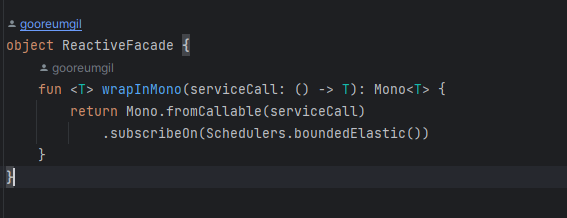
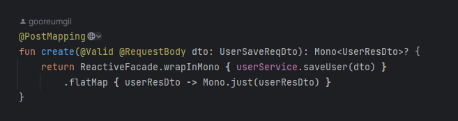
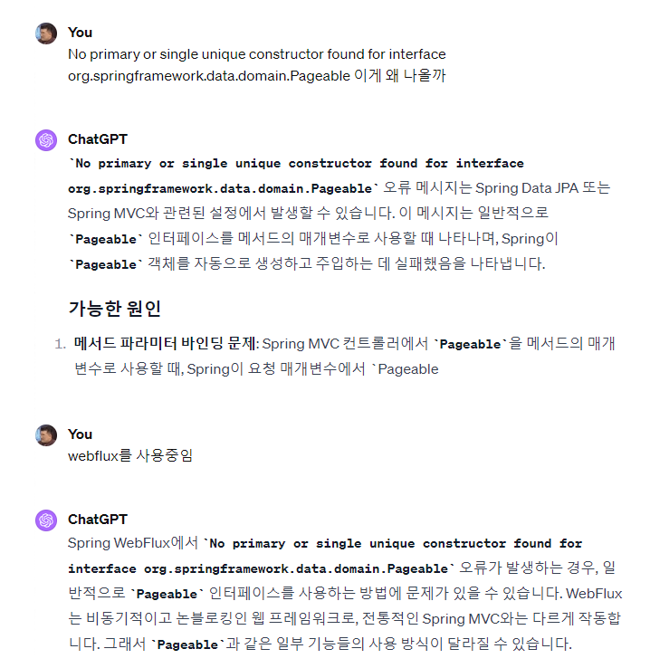
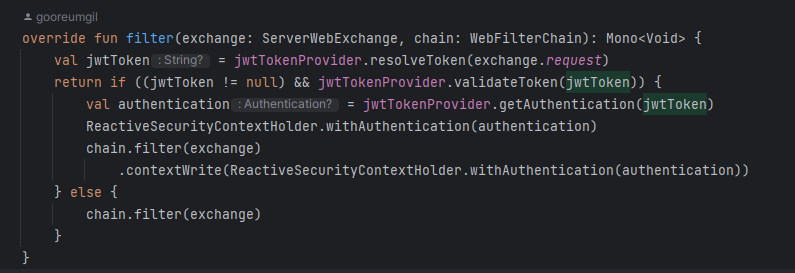

# 백엔드 엔지니어 사전과제 (이관석)

## 🏠 Overview

**소감**

백엔드 엔지니어 사전과제로 rest api를 개발하였다.

사용자가 게시글을 남기고 조회하는 api를 개발하였다. 원래는 게시글에 댓글도 남기고 좋아요도

남기는 방식으로 개발을 하려고 하였으나 Kotlin의 사용은 처음이었고 SpringWebFlux의 경우도 

외부 api를 호출하는데에만 사용을 해 보았지 어플리케이션 자체에서 사용해 보는 것은 처음이어서 

기본적인 CRUD와 인증,인가를 초점으로 개발 할 수 밖에 없었다 ㅠ

시간이 부족하여 테스트 코드도 작성하지 못하였다. 아쉬움이 남는다..
  
webflux가 도입이 되니 다른 모든 것들을 그에 맞춰서 바꾸어야만 했다. 
Reactor 프로그래밍 모델 설계상 전체 로직이 non-blocking 이어야만 의미가 있다고 했다.

물론 전체를 다 reactive 하게 설계하지는 못했다. JPA단에서 막혀서 서칭을 해보니 R2DBC를 사용해야만 한다고 했다. 
그러나 DB단까지 적용하기는 무리여서 @Service 로직을 ReactiveFacade를 만들어서 감싸는 방식으로 해결을 하였다.

***
**나의 선생님 Chatgpt**

Kotiln과 SpringWebFlux가 생소 했던 나에게 Chatgpt는 최고의 선생님이었다.

기존의 내가 하던 Java, SpringMvc로 하던 방식을 토대로 

Kotlin, SpringWebflux에서는 어떤식으로 하는지 물었던 것이 큰 도움이 되었다.

이젠 Ai를 잘 쓰는것도 개발자의 덕목이 될 수 있겠구나 싶었다. 한번도 경험해보지 못했던 언어로

불과 4~5일만에 프로젝트를 만들었으니 말이다.
  
**Spring Security**

기존의 SpringMvc 프로젝트와는 다르게 JwtAuthFilter를 만들 때 WebFilter라는 인터페이스를 구현하였다.

Mvc프로젝트의 경우 SecurityContextHolder에서 context를 불러온후 setAuthentication을 해주면

context가 유지가 됐었는데 webFlux방식에서는 동작하지 않았다.

이 또한 Chatgpt한테 물어보니 Reactor 프로그래밍 모델에서는 context가 전파되지 않는 경우가 있다고 하였다.

그래서 context를 전파할 수 있는 방법을 물었고 그에 대한 해답을 준 덕분에 해결할 수 있었다.

contextWrite() 부분이 전파하는 부분이다.

  

***
**UserController 분리**

jwtToken을 가지고 접근했을 때 조금 더 수월하게 api를 사용할 수 있도록 RestController를 만들었다.

USER_ROLE에 맞추어서 AuthenticatedUserController, AuthenticatedManagerController, AuthenticatedAdminController를 만들었다.

이런방식의 이점은 애시당초 해당 url로 넘어올 때 인증, 인가처리가 되었기 때문에 controller나 service로직에서 권한과 관련된 로직을

처리할 필요가 없다는 것이다.

만약 자신이 작성한 게시글을 페이징으로 보고 싶다면 요청 Header에 jwtToken을 Bearer 형식으로 담아

"/api/authenticated/user/articles"를 호출하면 된다.

컨틀롤러에서 jwtToken을 읽어와 securityContext에 넣어놓은 authentication을 @AuthenticationPrincipal로 가져와서

해당객체의 id를 꺼내서 사용할 수 있기 때문이다.
  

**예외 처리**

예외처리를 적절하게 하여 api에서 해당 예외에 맞는 응답을 줄 수 있도록 adviceController를 활용하였다.

adviceController에서 BindingError를 처리하다가 고생을 하였는데 webFlux에서는 WebExchangeBindException 객체로

bindingError를 처리한다는 것을 알게 되었다.
  

**데이터**

java진영의 ORM인 jpa, DB는 PostgreSql을 Docker에 띄워놓고 사용하였다. 

DB가 떠있지 않은 상황에서도 테스트를 할 수 있게 h2 의존성도 추가를 해놓았고

application.yml에 메모리 방식의 h2 설정을 메모리 주석을 달아놓았다.

물론 @Configuration 으로 h2와 Postgresql 설정을 나누어 놓고 @Import를 사용해야 하지만

시간관계상 구현하지 못하였다 ㅠㅠ 그래서 무식한 방법으로...

  

## 🏛️ Structure

### Api 

어플리케이션의 rest api

**domain**

- User
- UserRole
- Article

## 🎢 Tech Stack

- java 11
- gradle 8.5
- spring boot 2.7.6
- spring web flux
- h2
- jpa
- lombok

## 🙋‍♂ Outro
️좋은 기회를 주셔서 감사합니다.